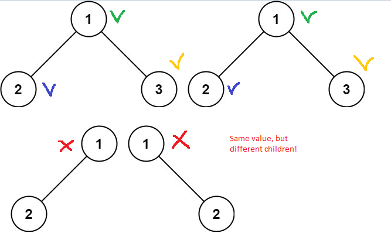

# Same Tree

## Problem

Given the roots of two binary trees p and q, write a function to check if they are the same or not.

Two binary trees are considered the same if they are structurally identical, and the nodes have the same value.


_Examples_

 

```
Input: p = [1,2,3], q = [1,2,3]
Output: true
```


```
Input: p = [1,2], q = [1,null,2]
Output: false
```


# Recursive Approach 

The simplest approach might be to check recursively whether nodes have the same value and have the same neighbouring nodes, valorised or not.


```
func IsSameTree(p *TreeNode, q *TreeNode) bool {

    // Let's check if nodes are identical
	if (p.Val != q.Val) ||
		(p.Right == nil && q.Right != nil) ||
		(p.Right != nil && q.Right == nil) ||
		(p.Left == nil && q.Left != nil) ||
		(p.Left != nil && q.Left == nil) {
		return false
	} else {
		// Means that nodes are leaves, otherwise false is returned
		if p.Right == nil {
			return true
		} else {
			return IsSameTree(p.Left, q.Left) && IsSameTree(p.Right, q.Right)
		}
	}
}
```



