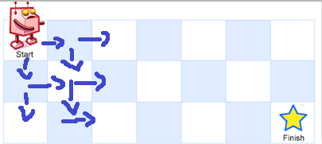
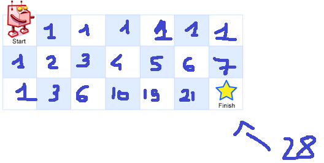

# UniquePaths

## Problem 

There is a robot on an *m x n grid*. The robot is initially located at the top-left corner (i.e., *grid[0][0]*). The robot tries to move to the bottom-right corner (i.e., *grid[m - 1][n - 1]*). The robot can only move either down or right at any point in time.

Given the two integers *m* and *n*, return the number of possible *unique paths* that the robot can take to reach the bottom-right corner.

## Dynamic Programming Approach

We could think of using a recursive strategy and retrieve all the paths found on individual cells backwards. However, this would lead to a waste of resources, as the cells would be traversed several times and thus the unique paths would be recalculated unnecessarily. 

One approach is to use memoisation, whereby we can use an external structure to save the previously calculated value without having to recalculate it. 

In particular, we note that we can define the number of unique paths traversing a cell as the sum of the unique paths traversing neighbouring cells. 

Knowing also that the only allowed directions are right and down, we can initialise to 1 all cells that are at the beginning of the row or the beginning of the column. 

